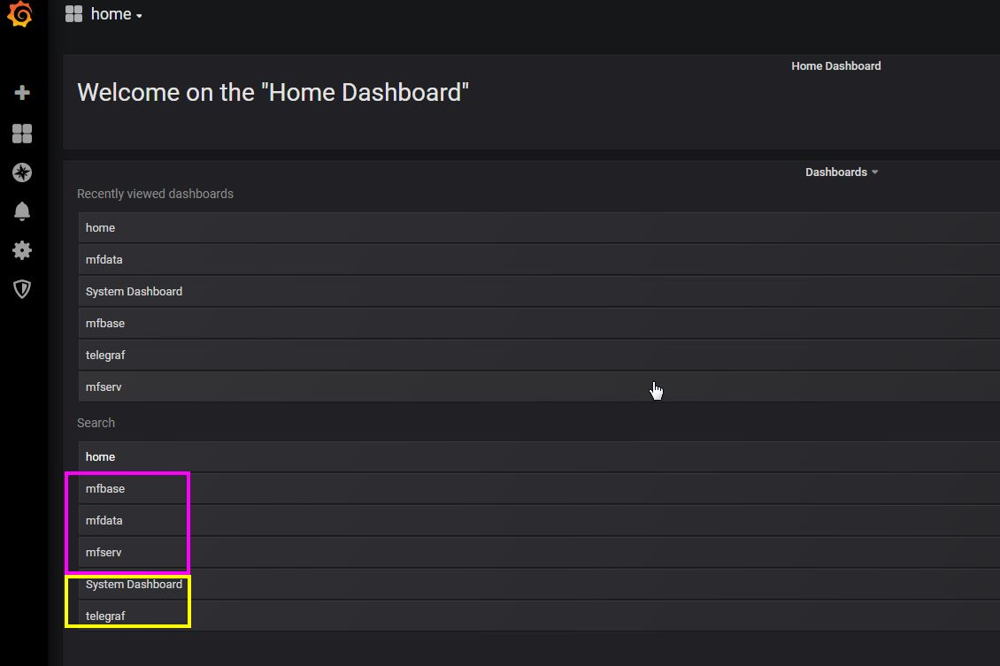
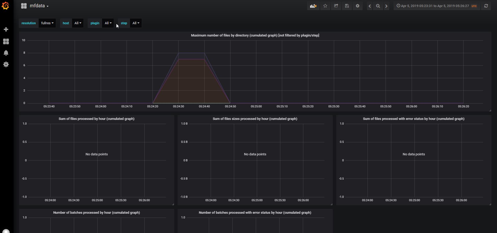
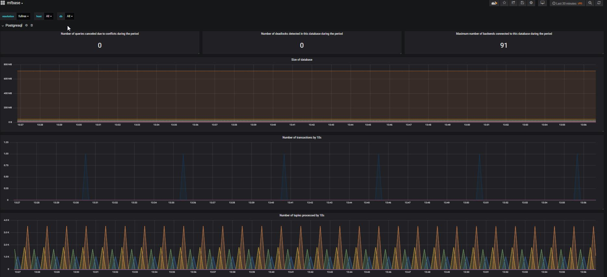

# Monitoring MetWork plugins

This section shows how to configure MetWork modules so that you can monitor your plugin and display dashboards through the :ref:`tools offered in MFADMIN <mfadmin_intro:How it works?>`:

## Configuration

In order to monitor MetWork plugins, you have to:

- install Metwork MFADMIN and MFSYSMON modules
- configure the `[admin]` section of the `config/config.ini` in the root directory of the MetWork module (i.e. MFDATA, MFSERV, MFBASE,...), 

To tell you want to monitor your plugins, first, set the `hostname` parameter value with the host name or IP address where MFADMIN is running:

```cfg
[admin]
# null => no monitoring
# hostname=null
# By setting hostname = localhost, we assume MFADMIN is running on the same Linux machine, 
# if MFADMIN is running on a different machine, set hostname = {your_host_name} or { your_host_ip_address}
hostname=localhost
# influxdb_http_port=18086
...
```

**This will enable monitoring and the time-series metrics (by default)**. The metrics will be stored in the :index:`InfluxDB` databases of the MFADMIN host. The corresponding dashboards will be available through :index:`Grafana` on the MFADMIN host.

If you want to monitor your plugins through [mflog](https://github.com/metwork-framework/mfloglogs) logs, in addition you have to configure the `send_mflog_logs` parameter in the the `[admin]` section of the `config/config.ini` :

```cfg
[admin]
...
# If send_mflog_logs=1, send mflog logs to the configured admin hostname
send_mflog_logs=1
...
```

**This will enable the mflog logs** to be stored in the :index:`ElasticSearch` database of the MFADMIN host. The corresponding dashboards will be available through :index:`Kibana` on the MFADMIN host.


If you want to monitor the **nginx access logs**, you have to configure the `send_nginx_logs` parameter in the the `[admin]` section of the `config/config.ini` :

```cfg
[admin]
...
# If send_nginx_logs=1, send nginx access logs to the configured admin hostname
send_nginx_logs=1
...
```

**This will enable the nginx access logs** to be stored in the :index:`ElasticSearch` database of the MFADMIN host. The corresponding dashboards will be available through :index:`Kibana` on the MFADMIN host.


**Then, you have to restart the corresponding Metwork module service (MFDATA, MFSERV, MFBASE, ...)**, e.g:
```bash
service metwork restart mfdata
```

## Grafana Time-series dashboards
Dashboards are available from MFADMIN :index:`Grafana GUI Interface` which is displayed through HTTP on `http://{your_mfadmin_host}:15602`(default login is `admin/admin`), e.g. http://localhost:15602.


Then, click on the module you want display dashboards.




- Some default MFDATA dashboards:




- Some default MFBASE dashboards:



.. tip::
    You may want to implement your own dashboard with specific metrics. In order to do this, you may refer to :ref:`mfadmin_miscellaneous:Create specific dashboards` and the :ref:`mfdata_additional_tutorials:Implement custom monitoring and metrics in a plugin`.

## Kibana dashboards

.. todo:: fill up the documentation + add tutorial

<!--
Intentional comment to prevent m2r from generating bad rst statements when the file ends with a block .. xxx ::
-->
